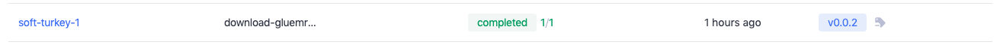

# dstack-examples
Examples on getting started with dstack.

## Tutorials

### How to easily fine-tune a HuggingFace model with Accelerate and dstack

In this tutorial, we will learn how to fine-tune a `bert-base-cased` model on `GLUE MRPC` dataset on AWS infrastructure. We will use `dstack workflows` to run our jobs on a cpu, single-gpu and multiple-gpu instances.

#### Step 1: Set up on-demand runners

To use on-demand runners, go to the Settings, then AWS.

Here, you have to provide AWS Access Key ID and AWS Secret Access Key that have the corresponding permissions to create EC2 instances in your AWS account.

Once you've provided credentials, use the Add limit button to configure limits:


The configured Limits represent the maximum number of EC2 instances of the specific Instance Type and in the specific Region, that dstack can create at one time to run workflows.

#### Step 2: Install the CLI

Now, to be able to run workflows, install and configure the dstack CLI:

```sh
pip install dstack -U
dstack config --token <token>
```

Your token value can be found in Settings:


#### Step 3: Clone the repo
In this tutorial, we'll run workflows defined in [github.com/dstackai/dstack-examples](https://github.com/recohut/dstack-examples).

```sh
git clone https://github.com/recohut/dstack-examples
cd dstack-examples
```

This project includes 4 workflows. Two of them are for MNIST project (which was also covered in [Quickstart tutorial](https://docs.dstack.ai/quickstart/)) and the other two workflows - `download-gluemrpc` and `finetune-gluemrpc` are the ones we will use in this tutorial. The `download-gluemrpc` workflow downloads the GLUE MRPC dataset using `HF Datasets` library and stores it into `data` artifact folder. The second workflow `finetune-gluemrpc` then loads the data from that same artifact folder and fine-tunes the `bert-base-cased` model using it. After fine-tuning, we stores the model in the `model` artifact folder, from which we can download our trained model easily.

```yaml
workflows:
  - name: download-gluemrpc
    provider: python
    requirements: src/gluemrpc/requirements.txt
    python_script: src/gluemrpc/download.py
    artifacts:
      - data
  - name: finetune-gluemrpc
    provider: python
    requirements: src/gluemrpc/requirements.txt
    python_script: src/gluemrpc/finetune.py
    depends-on:
      - download-gluemrpc:v0.0.2
    artifacts:
      - model
    resources:
      gpu: ${{ fgpu }}
```

### Step 4: Run workflows
Go ahead, and run the `download-gluemrpc` workflow using the following command:

```sh
dstack run download-gluemrpc
```

This single command will spin-up a docker inside one of the runner instances on AWS, install the libraries, run the `src/gluemrpc/download.py` script inside that spinned-up docker, saves the data in the `data` folder and maintains/shows the logs in dstack gui (https://dstack.ai/runs). Once the Job gets completed, it will look like this:



You can see that we have tag also. This tag will help us in running the next workflow when we will fine-tune the model. To add a tag to any run, we need to know the run name first. In this case, our run name is `soft-turkey-1`, so we can execute the following command to add the tag:

```sh
dstack tag -n v0.0.2 soft-turkey-1
```

Now, we will run the fine-tune workflow `finetune-gluemrpc`.

You can use the following command to run it:

```sh
dstack run finetune-gluemrpc
```

If you want to change any of the variables, you can do that in .dstack/variables.yaml, or from the CLI. 

For instance, if you want to run on a gpu instance, you can use the following command:

```sh
dstack run finetune-gluemrpc --fgpu 1
```

Similarly, to run on multiple gpus, feel free to change the flag in cli, e.g. following command will run the job on 2 gpus:

```sh
dstack run finetune-gluemrpc --fgpu 2
```

In the following image, you can see how the jobs look on the dstack gui:


We can also get a detailed snapshot of the job:


It is also possible to download the trained model using the following command:

```sh
dstack artifacts f9e547065481 --output artifacts/glue_mrpc
```

Here, note that `f9e547065481` is our job id. This command will download the trained model in the local artifacts/glue_mrpc folder.

It's now time to give a try to dstack, and run your workflow.